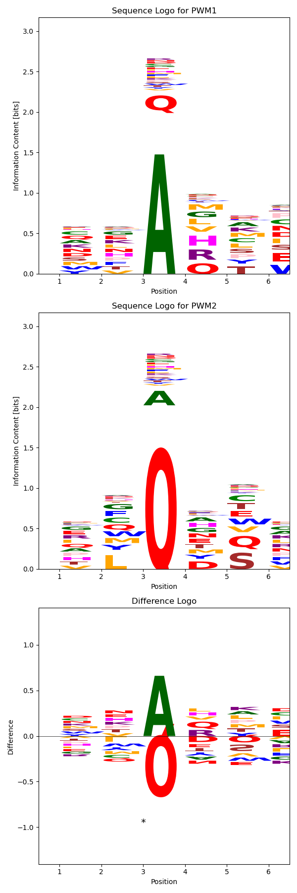

# DiffLogo: Comparative Visualization of Sequence Motifs in Python

[](https://opensource.org/licenses/MIT)

## Overview

This repository provides a Python implementation of the **DiffLogo** tool for comparative visualization of sequence motifs, originally developed by Nettling et al. in R ([Original Repo](https://github.com/mgledi/DiffLogo/tree/master)). The script allows users to generate sequence logos and difference logos from two sets of sequences, compute statistical significance of motif differences, and incorporate substitution matrices (e.g., BLOSUM) as priors for amino acid substitution likelihoods.

## Background

**DiffLogo** is a visualization technique that extends traditional sequence logos to compare two motifs by highlighting their differences. It provides insights into the positions and symbols (nucleotides or amino acids) that differ significantly between two classes of sequences.

**Reference:**

- Nettling M, Treutler H, Grau J, Keilwagen J, Posch S, Grosse I. DiffLogo: a comparative visualization of sequence motifs. BMC Bioinformatics. 2015 Nov 17;16:387. doi: 10.1186/s12859-015-0767-x. PMID: 26577052; PMCID: PMC4650857.

## Features

- **Sequence Logo Generation:** Create sequence logos for each class of sequences to visualize motif patterns.
- **Difference Logo Generation:** Generate difference logos to highlight significant differences between motifs.
- **Statistical Significance Testing:** Compute p-values for motif differences using permutation tests and adjust for multiple testing using the Benjamini-Hochberg procedure.
- **Alphabet Support:** Supports DNA, RNA, and protein sequences with customizable alphabets and color schemes.
- **Substitution Matrix Integration:** Incorporate substitution matrices (e.g., BLOSUM, PAM) as priors for amino acid substitution likelihoods in protein sequence analysis.
- **Customizable Parameters:** Users can specify the substitution matrix, number of permutations for statistical tests, and choose the alphabet.

## Additions Beyond the Original Code

While the original DiffLogo tool was implemented in R and primarily focused on DNA motifs, this Python implementation extends the functionality with the following additions:

- **Python Implementation:** The script is rewritten in Python for broader accessibility and integration with Python-based bioinformatics workflows.
- **Protein Sequence Support:** Added support for protein sequences, including handling of the standard 20 amino acids and their visualization in sequence logos.
- **Substitution Matrices:** Integrated substitution matrices from Biopython (e.g., BLOSUM, PAM) to incorporate evolutionary information into motif comparison.
- **User-Specified Matrices:** Users can specify which substitution matrix to use for protein sequences, allowing for tailored analyses based on evolutionary distances.
- **Statistical Significance Calculation:** Implemented permutation tests to compute p-values for motif differences, along with multiple testing correction.
- **Command-Line Interface:** Enhanced input and output handling to accept FASTA files for each class of motifs and added command-line arguments for customization.

## Installation

### Prerequisites

- Python 3.6 or higher
- Required Python packages:
  - `numpy`
  - `matplotlib`
  - `scipy`
  - `statsmodels`
  - `biopython`

### Install Packages

Install the required packages using `pip`:

```bash
pip install numpy matplotlib scipy statsmodels biopython
```

## Usage

### Command-Line Arguments

```bash
python diff_logo.py [-h] [--alphabet {DNA,RNA,PROTEIN}] [--matrix MATRIX] [--n_permutations N_PERMUTATIONS] [--pval-csv PVAL_CSV]
                    [--fig-out FIG_OUT]
                    fasta1 fasta2
```

- `fasta1`: Path to the first FASTA file (sequences for class 1).
- `fasta2`: Path to the second FASTA file (sequences for class 2).
- `--alphabet`: Alphabet to use (`DNA`, `RNA`, or `PROTEIN`). Default is `DNA`.
- `--matrix`: Substitution matrix to use for protein sequences. Default is `BLOSUM62`. Available options:
  - BLOSUM matrices: `BLOSUM45`, `BLOSUM50`, `BLOSUM62`, `BLOSUM80`, `BLOSUM90`
  - PAM matrices: `PAM30`, `PAM70`, `PAM250`
- `--n_permutations`: Number of permutations for statistical significance testing. Default is `1000`.
- `--pval-csv` PVAL_CSV: Path to save LOG(p-values) as a CSV file. Default is None. if None, p-values are not saved.
- `--fig-out` FIG_OUT: Path to save the figure. Default is None. if None, the figure is displayed.

### Examples

#### DNA Sequences

```bash
python diff_logo.py class1_dna.fasta class2_dna.fasta --alphabet DNA --n_permutations 1000
```

#### Protein Sequences with BLOSUM62 Matrix

```bash
python diff_logo.py class1_protein.fasta class2_protein.fasta --alphabet PROTEIN --matrix BLOSUM62 --n_permutations 1000
```

#### Protein Sequences, save the p-value and figure image

```bash
python diff_logo.py class1_protein.fasta class2_protein.fasta --alphabet PROTEIN --matrix BLOSUM62 --n_permutations 1000 --pval-csv out.csv --fig-out figure.png
```

### Output

The script generates:

- **Sequence Logos**: Displays the sequence logos for each class of sequences.
- **Difference Logo**: Visualizes the differences between the two motifs, highlighting significant positions.
- **Statistical Results**: Prints the total divergence and indicates significant positions on the difference logo with asterisks.

### Notes

- **Sequence Requirements**: All sequences in each FASTA file must be of the same length, and the sequences in both files must have the same length.
- **Alphabet Characters**: Ensure that sequences contain only valid characters from the specified alphabet. Unknown or ambiguous characters are ignored by default.
- **Performance**: The permutation test can be computationally intensive for large datasets or a high number of permutations. Adjust `--n_permutations` based on available computational resources.

## Example Output

After running the script with example FASTA files, the following outputs are generated:

### Sequence Logos and Difference Logo

The script produces sequence logos for each class of sequences and a difference logo highlighting the significant differences between the motifs.

Running the script with the following command:

```bash
python diff_logo.py --alphabet PROTEIN example/seq1.fasta example/seq2.fasta --pval-csv example/pvals.csv --fig-out example/figure.png
```

produces the following output:



*Figure 1: Sequence logos for each class and the difference logo showing significant differences.*

### P-Value Results

The script also outputs a CSV file containing the p-values for each position, indicating the statistical significance of the differences observed.

**Example `p_values.csv`:**

| Position | P-Value |
|----------|---------|
| 1.0      | -0.0661 |
| 2.0      | -0.0121 |
| 3.0      | -4.02   |
| 4.0      | -0.272  |
| 5.0      | -0.272  |
| 6.0      | -0.12   |


*Table 1: P-values for each position after multiple testing correction (Benjamini-Hochberg method).*

The CSV file can be found in the `example/` directory

---

## Script Details

### Functions

- `get_sequences_from_fasta_file`: Reads sequences from a FASTA file.
- `get_counts_from_sequences`: Computes counts of each symbol at each position.
- `counts_to_pwm`: Converts counts to a Position Weight Matrix (PWM).
- `information_content`: Calculates the information content of a probability vector.
- `shannon_divergence`: Computes the Jensen-Shannon divergence between two probability distributions.
- `create_substitution_matrix`: Constructs a substitution probability matrix from a substitution matrix.
- `compute_position_divergences`: Calculates divergence at each position between two PWMs.
- `substitution_divergence`: Computes divergence using substitution matrix probabilities.
- `permutation_test`: Performs permutation tests to compute p-values for motif differences.
- `add_letter`: Renders letters for sequence logos.
- `seq_logo`: Generates a sequence logo from a PWM.
- `diff_logo`: Generates a difference logo between two PWMs.

### Classes

- `Alphabet`: Represents an alphabet with characters, colors, and other properties.

### Dependencies

- **NumPy**: Numerical computations.
- **Matplotlib**: Plotting sequence logos and difference logos.
- **SciPy**: Statistical functions.
- **Statsmodels**: Multiple testing correction.
- **Biopython**: Access to substitution matrices.

## References

- Nettling M, Treutler H, Grau J, Keilwagen J, Posch S, Grosse I. DiffLogo: a comparative visualization of sequence motifs. BMC Bioinformatics. 2015 Nov 17;16:387. doi: 10.1186/s12859-015-0767-x. PMID: 26577052; PMCID: PMC4650857.
- [Biopython Documentation](https://biopython.org/wiki/Documentation)

## License

This project is licensed under the MIT License - see the [LICENSE](LICENSE) file for details.

## Acknowledgments

- **Original Authors**: Martin Nettling, Hendrik Treutler, and colleagues for developing the DiffLogo methodology.
- **Biopython Community**: For providing tools and resources for bioinformatics in Python.

## Contact

For questions or suggestions, please open an issue on the GitHub repository.
